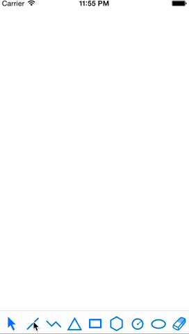
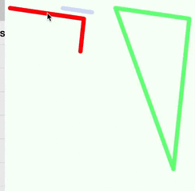
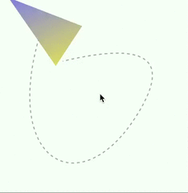
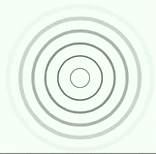
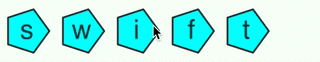
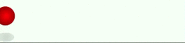
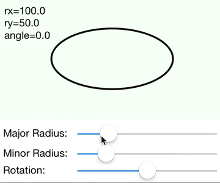
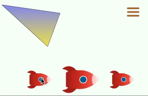

# ShapeAnimation-Swift

Vector animation framework in Swift based on [SwiftGraphics](https://github.com/schwa/SwiftGraphics) for iOS 8.

With ShapeAnimation you can easily create various animations with a nice Swift based syntax.

[![Travis][travis_img]][travis]

[travis]: https://travis-ci.org/rhcad/ShapeAnimation-Swift
[travis_img]: https://travis-ci.org/rhcad/ShapeAnimation-Swift.svg?branch=Scratch

SVG animation development with [SVGKit](https://github.com/SVGKit/SVGKit) happens on the [SVG][svg_branch] branch.

[svg_branch]: https://github.com/rhcad/ShapeAnimation-Swift/tree/SVG

## What's included

* ShapeView class which contains vector shape layers.
  * Helper functions to add image, text, circle, regular polygon, lines and other shapes.
  * Support gradient fill with animation.

* Animation extension functions of CALayer and CAShapeLayer.
  * opacityAnimation, flashAnimation
  * scaleAnimation, tapAnimation
  * rotate360Degrees, rotationAnimation
  * shakeAnimation
  * moveAnimation, moveOnPathAnimation
  * slideToRight
  * strokeEndAnimation
  * strokeColorAnimation, lineWidthAnimation, dashPhaseAnimation
  * switchPathAnimation
  * animationGroup for the same layer
  * applyAnimations for multiple layers

* Animations with customized properties
  * Use AnimationLayer class to draw customized animations.
  * Animation with sliders example: [EllipseViewController.swift](ShapeAnimation_UITest/EllipseViewController.swift)













## Usage

Please see the examples in [MasterViewController.swift](ShapeAnimation_UITest/MasterViewController.swift).

``` Swift
let layer1 = self.addLinesLayer(view, points:[(10.0,20.0),(150.0,40.0),(120.0,320.0)])
layer1.strokeEndAnimation().apply() {
    layer1.shakeAnimation().apply()
}

let la2 = self.addLinesLayer(view, points:points2, color: UIColor.blueColor())
lla2.scaleAnimation(from:1, to:1.1, repeatCount:3).apply(duration:0.3)

let la3 = self.addLinesLayer(view, points:points3, color: UIColor.greenColor())
la3.flashAnimation(repeatCount:6).apply()

let la4 = self.addLinesLayer(view, points:[(10.0,20.0), (150.0,40.0), (120.0,120.0)])
let a1 = la4.moveOnPathAnimation(path).set {$0.duration=1.6}
let a2 = la4.rotate360Degrees().set {$0.repeatCount=2}
animationGroup([a1, a2]).set {$0.autoreverses=true}.apply()
```

## Help Wanted

All of this code is very much a _*work in progress*_. I'm adding and changing functionality as needed.

Your help wanted. Please fork this project and submit pull requests or [issues][issues].
[issues]: https://github.com/rhcad/ShapeAnimation-Swift/issues

Contributions are always welcome in the following areas:

* Header doc comments explaining what the functions do
* Useful animation template or application examples
* Fix issues about animation, Swift usage rules or translations

## License

ShapeAnimation-Swift is released under a BSD License. See LICENSE file for details.

## FAQ

* Could not build Objective-C module 'ShapeAnimation':
  - Quit Xcode and delete the sub folders in ~/Library/Developer/Xcode/DerivedData/.
